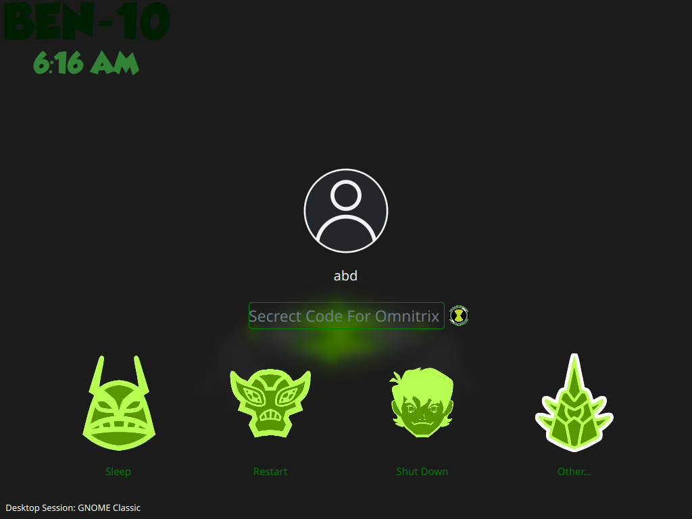
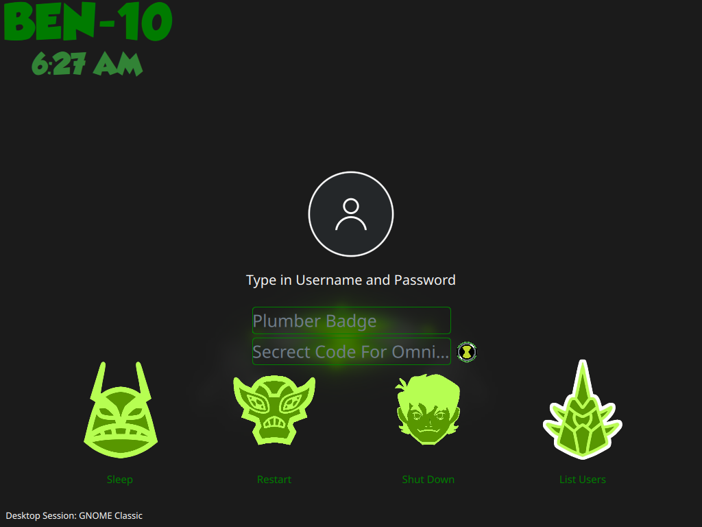
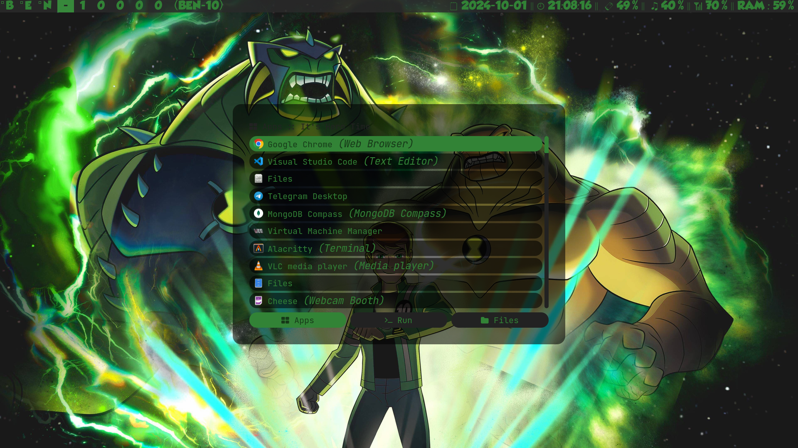
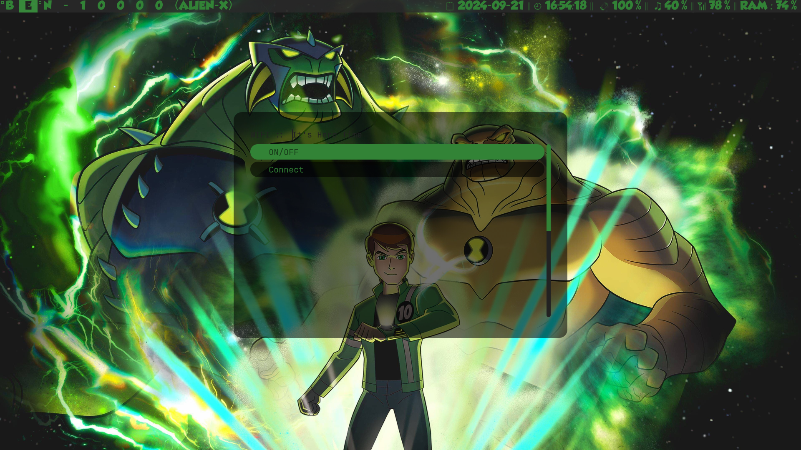
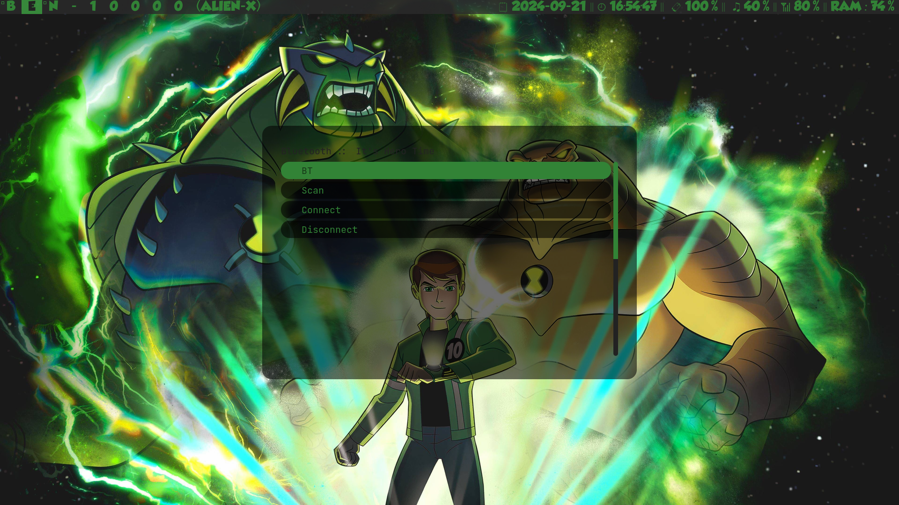

# BEN-10-DWM
# Preview
## BEN10-SDDM
### Login




## BEN10-DWM
### Home

### Menu


### Power Menu


### Wifi


### Bluetooth


> [!NOTE]
> This project is still in development, so there may be incomplete functionalities or customizations. Contributions and feedback are welcome!
> Currently, only **Debian-based** systems are supported by the install script.
> Custom Ben 10-themed SDDM configurations and wallpapers are included!

> [!WARNING]
> Please review the install script before proceeding with the installation.

> [!CAUTION]
> If you have existing **SDDM** or **Picom** configurations, they will be replaced by the installation script.

## 🚀 Getting Started

The install script will install **DWM**, **SDDM**, and **Picom**.
### Clone this repository
```bash
git clone https://github.com/bharani2624/BEN-10-DWM ~/BEN-10-DWM
cd ~/BEN-10-DWM
```
### Run the install script
```bash
./install.sh
```

## 🐞 Issues and Feedback

The project is in active development. If you have any suggestions or encounter any issues, please submit feedback via the [GitHub Issues page](https://github.com/bharani2624/BEN-10-DWM/issues).

## 🛠 Contributing

Contributions are welcome! Feel free to submit pull requests to add features or resolve issues.

## 📧 Contact

For more information, reach out to the project maintainer on GitHub: [bharani2624](https://github.com/bharani2624)